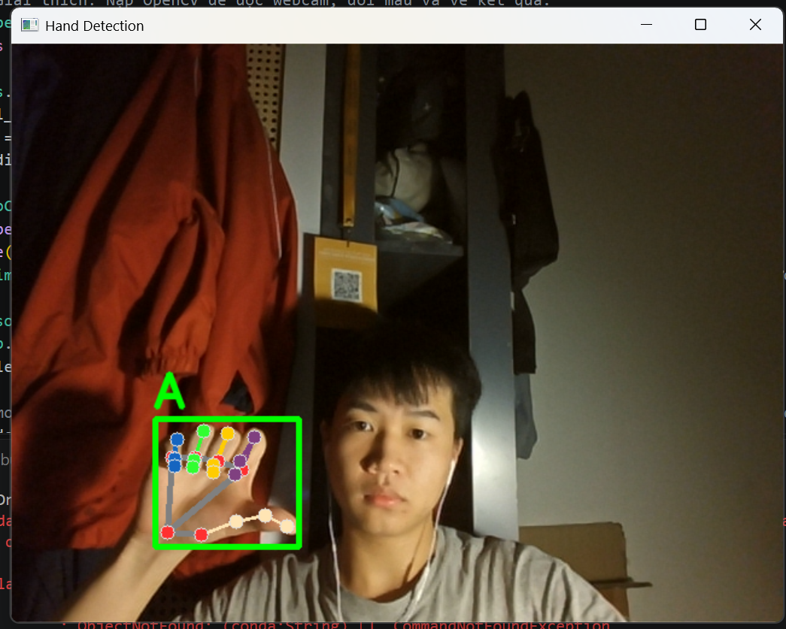
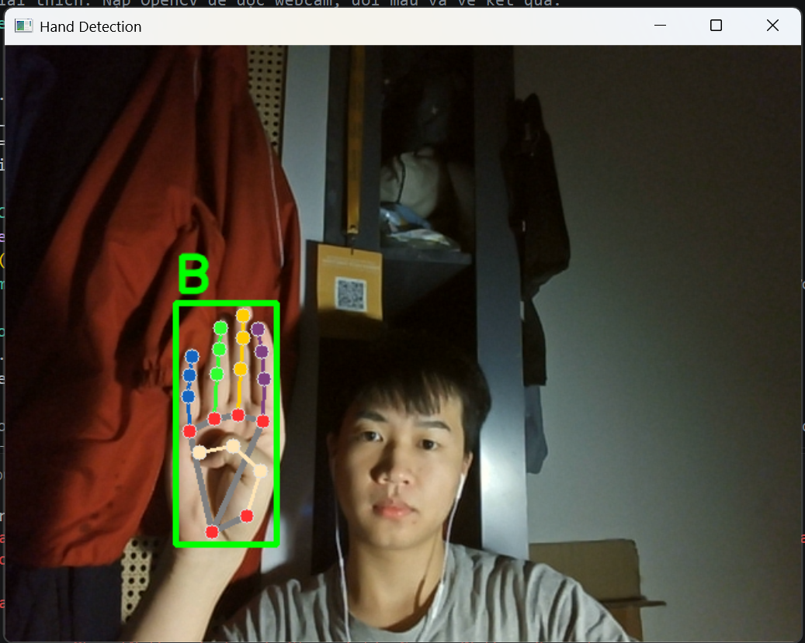
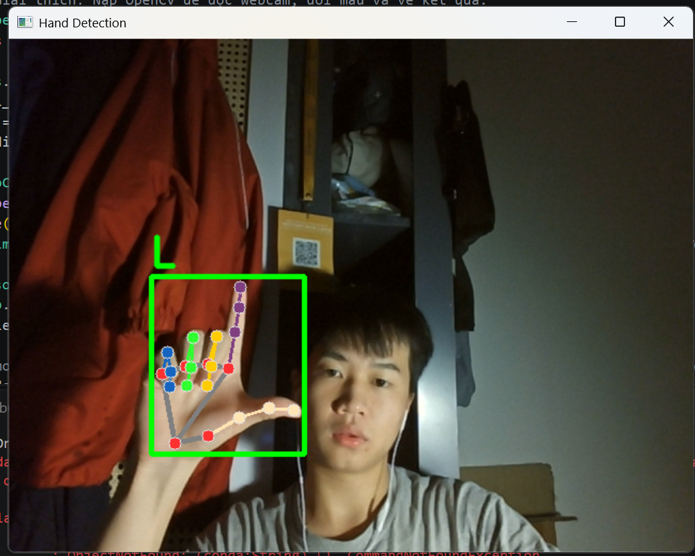
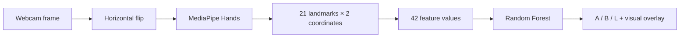

<div align="center">

# Sign Language Detection

**Recognize three hand gestures from a live webcam feed.**

OpenCV · MediaPipe Hands · Random Forest

[Quick start](#quick-start) · [Demo](#demo) · [How it works](#how-it-works) · [Training](#train-your-own-model) · [Limitations](#limitations)

</div>

An educational computer vision project that detects one hand, extracts 21 landmarks, and classifies the pose as **A**, **B**, or **L**. The application displays the predicted label, hand skeleton, and bounding box in a mirrored webcam view.

The repository includes a trained model and a landmark dataset, so you can start the demo without collecting images or training first. The three labels are the project's gesture classes; this demo does not interpret continuous sign language or validate a standardized alphabet.

## Demo

<table>
  <tr>
    <th align="center">A</th>
    <th align="center">B</th>
    <th align="center">L</th>
  </tr>
  <tr>
    <td></td>
    <td></td>
    <td></td>
  </tr>
</table>

*Screenshots from the original webcam demonstration. These illustrate the interface, not an independent accuracy benchmark.*

## Quick start

Use **64-bit Python 3.11 or 3.12**, a webcam, and a desktop session that can display OpenCV windows. The dependency set has been checked locally on Windows with Python 3.12.

```bash
git clone https://github.com/DuongDuyet2909/sign_language_detection.git
cd sign_language_detection
```

Create and activate an isolated environment:

```powershell
# Windows PowerShell
$venvPath = Join-Path $env:LOCALAPPDATA "venvs\sign-language-detection"
py -3.12 -m venv $venvPath
& "$venvPath\Scripts\Activate.ps1"
```

```bash
# macOS / Linux
python3 -m venv .venv
source .venv/bin/activate
```

Then install dependencies and launch the demo:

```bash
python -m pip install -r requirements.txt
python inference_classifier.py
```

Hold one hand in view and make a gesture matching the demo. Press **Q** or **Esc** while the OpenCV window is focused to exit. To select another webcam:

```bash
python inference_classifier.py --camera 1
```

**Windows path requirement:** keep the Python environment in a path containing only ASCII characters. MediaPipe 0.10.21 can fail to load its graph files when its installation path contains accented characters. If your Windows username contains accents, choose another writable ASCII-only path for `$venvPath`. Project and image paths may contain Vietnamese characters when the environment itself is in an ASCII-only location.

If PowerShell blocks activation, use `& "$venvPath\Scripts\python.exe"` in place of `python`; changing the execution policy is not necessary.

## How it works



| Component | Implementation |
| --- | --- |
| Capture and display | OpenCV webcam input and GUI |
| Hand detection | MediaPipe Hands, one hand per frame |
| Features | Landmark `(x, y)` coordinates, flattened in landmark order |
| Classifier | Random Forest with 100 trees and `random_state=42` |
| Evaluation | Stratified 80/20 split with `random_state=42` |
| Output | Class label, landmark skeleton, and bounding box |

The training and inference scripts use the same 42-value representation. Coordinates are relative to the **image**, not normalized to the hand's position or size. This preserves compatibility with the bundled model and also makes framing important.

## Repository structure

```text
sign_language_detection/
├── assets/                    # Original A/B/L demo screenshots
├── tests/                     # Automated checks without opening a webcam
├── collect_imgs.py            # Capture and append labeled webcam images
├── create_dataset.py          # Extract one hand's landmarks from each image
├── train_classifier.py        # Train, evaluate, and save a Random Forest
├── inference_classifier.py    # Run the live webcam demo
├── data.pkl                   # Bundled landmark dataset
├── model.p                    # Bundled trained classifier
├── requirements.txt           # Pinned application dependencies
└── .gitignore                 # Exclude raw captures and local environments
```

## Bundled data and model

The dataset contains **240 samples**, each with **21 pairs of coordinates**. It stores landmarks and class labels, not the original webcam images.

| Class ID | Display label | Samples |
| --- | --- | ---: |
| `0` | A | 82 |
| `1` | B | 100 |
| `2` | L | 58 |
| **Total** | | **240** |

`data.pkl` contains `{"data": ..., "labels": ...}`. `model.p` contains `{"model": ...}` and was saved using **scikit-learn 1.9.1**. The original dataset and model are retained in this repository.

Only load pickle files from sources you trust: loading a pickle can execute Python code. Keep the pinned scikit-learn version when using the bundled model, or retrain in your chosen environment. See [scikit-learn's model persistence guidance](https://scikit-learn.org/stable/model_persistence.html).

## Train your own model

### 1. Collect images

```bash
python collect_imgs.py --camera 0 --samples 100
```

The script prompts for **A → B → L**. For each class, press **Q** to begin collection or **Esc** to exit. It saves mirrored images to `data/0`, `data/1`, and `data/2`. Repeated runs append numbered images rather than overwrite existing captures. Raw images are excluded from Git.

Collect multiple sessions with varied lighting, hand positions, and participants. Keep a separate session for a meaningful final evaluation; adjacent webcam frames are highly similar.

### 2. Extract landmarks

```bash
python create_dataset.py
```

Supported input formats: JPG, JPEG, PNG, and BMP. The extractor supports Vietnamese paths on Windows, skips unreadable images or frames without a detected hand, and requires at least one usable sample in every class before saving. Each image should contain only one intended hand.

This command replaces `data.pkl` after validation. To keep the bundled dataset, choose another output:

```bash
python create_dataset.py --data-dir data --output my_data.pkl
```

### 3. Train and evaluate

```bash
python train_classifier.py --data my_data.pkl --output my_model.p
python inference_classifier.py --model my_model.p
```

Training prints holdout accuracy and a per-class precision/recall/F1 report. With no arguments, training reads `data.pkl` and replaces `model.p`. Each class needs enough samples for the stratified train/test split.

All scripts support `--help`. Default data and model paths are resolved relative to the scripts, so the application does not depend on the terminal's working directory.

## Checks

```bash
python -m pip check
python -m unittest discover -s tests -v
```

The automated checks cover Unicode image paths, invalid dataset handling, training to a temporary model, bundled-model compatibility, and camera failure cleanup. They do not open the physical webcam or establish real-world gesture accuracy.

## Limitations

- **Three classes only.** A detected hand is assigned to A, B, or L; there is no explicit unknown-gesture class, sentence recognition, or motion interpretation.
- **Small, imbalanced dataset.** Class L has 58 samples versus 100 for B. More varied, balanced data is needed before drawing broad conclusions.
- **Session leakage can inflate accuracy.** A random split may put near-duplicate frames from one recording in both training and test sets. A high score on that split does not establish performance on new people or sessions.
- **Position and scale matter.** Features use raw image-relative coordinates. Generalization to new hand positions, distances, and orientations is limited.
- **One hand at a time.** Multi-hand interactions and occluded poses are outside the current demo's scope.
- **Desktop demo.** A webcam and an OpenCV GUI are required. The legacy MediaPipe Hands API is pinned for compatibility; upgrading it may require code changes.

## Troubleshooting

| Problem | What to check |
| --- | --- |
| Camera cannot open | Close other camera applications, check OS camera access, or try `--camera 1`. |
| `mediapipe` has no `solutions` | Create a clean environment and install the pinned `requirements.txt`. |
| MediaPipe reports a missing `.binarypb` graph file | Recreate the Python environment in an ASCII-only path; do not reuse an environment installed under an accented directory. |
| Pickle version warning or model load failure | Use scikit-learn 1.9.1, or retrain the model in the active environment. |
| No hand or unstable predictions | Improve lighting, keep one hand fully visible, and match the collection setup. |
| Dataset folder is missing | Run `collect_imgs.py` before rebuilding the dataset. The bundled model can run without raw images. |
| Split fails while training | Add more usable samples to every class. A tiny class cannot support stratified evaluation. |

## References

- [MediaPipe Hands](https://chuoling.github.io/mediapipe/solutions/hands.html)
- [MediaPipe 0.10.21 package](https://pypi.org/project/mediapipe/0.10.21/)
- [OpenCV documentation](https://docs.opencv.org/4.x/)
- [RandomForestClassifier](https://scikit-learn.org/stable/modules/generated/sklearn.ensemble.RandomForestClassifier.html)

Maintained by [Duyet Duong Cong](https://github.com/DuongDuyet2909).
