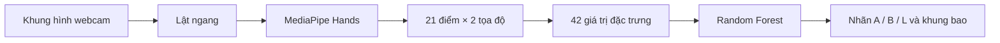

<div align="center">

# Nhận diện ký hiệu bàn tay

**Nhận diện ba ký hiệu A, B, L trực tiếp qua webcam.**

OpenCV · MediaPipe Hands · Random Forest

[Chạy nhanh](#chay-nhanh) · [Ảnh minh họa](#anh-minh-hoa) · [Cách hoạt động](#cach-hoat-dong) · [Huấn luyện](#huan-luyen) · [Giới hạn](#gioi-han)

</div>

Dự án thực hành thị giác máy tính: phát hiện một bàn tay, trích xuất 21 điểm đặc trưng (landmark) và phân loại tư thế thành **A**, **B** hoặc **L**. Chương trình hiển thị nhãn dự đoán, các điểm và đường nối trên bàn tay, cùng khung bao trong hình ảnh webcam được lật ngang như gương.

Repository có sẵn mô hình đã huấn luyện và bộ dữ liệu tọa độ, giúp bạn chạy thử ngay sau khi cài đặt thư viện. A, B, L là ba lớp ký hiệu của dự án; phiên bản này chưa diễn giải ngôn ngữ ký hiệu liên tục và chưa được kiểm chứng theo một bảng chữ cái ký hiệu chuẩn.

<a id="anh-minh-hoa"></a>

## Ảnh minh họa

<table>
  <tr>
    <th align="center">Ký hiệu A</th>
    <th align="center">Ký hiệu B</th>
    <th align="center">Ký hiệu L</th>
  </tr>
  <tr>
    <td></td>
    <td></td>
    <td></td>
  </tr>
</table>

*Ảnh chụp từ lần chạy webcam ban đầu, dùng để minh họa giao diện. Các ảnh này không phải phép đánh giá độ chính xác trên dữ liệu độc lập.*

<a id="chay-nhanh"></a>

## Chạy nhanh

Chuẩn bị **Python 3.11 hoặc 3.12 bản 64-bit**, webcam và môi trường máy tính có thể mở cửa sổ OpenCV. Bộ thư viện đã được kiểm tra trên Windows với Python 3.12.

### 1. Tải mã nguồn

```bash
git clone https://github.com/DuongDuyet2909/sign_language_detection.git
cd sign_language_detection
```

### 2. Tạo và kích hoạt môi trường ảo

**Windows PowerShell:**

```powershell
$venvPath = Join-Path $env:LOCALAPPDATA "venvs\sign-language-detection"
py -3.12 -m venv $venvPath
& "$venvPath\Scripts\Activate.ps1"
```

**macOS / Linux:**

```bash
python3 -m venv .venv
source .venv/bin/activate
```

**Lưu ý đường dẫn trên Windows:** môi trường Python cần nằm trong đường dẫn chỉ chứa ký tự ASCII, không có dấu tiếng Việt. MediaPipe 0.10.21 có thể không tải được tài nguyên khi đường dẫn cài đặt chứa ký tự có dấu. Nếu tên tài khoản Windows của bạn có dấu, hãy đặt `$venvPath` tại một thư mục không dấu khác mà bạn có quyền ghi. Thư mục mã nguồn và ảnh vẫn có thể chứa tiếng Việt khi môi trường Python được đặt ở đường dẫn phù hợp.

Nếu PowerShell chặn kích hoạt môi trường, dùng `& "$venvPath\Scripts\python.exe"` thay cho `python` trong các lệnh bên dưới; không cần thay đổi chính sách thực thi của PowerShell.

### 3. Cài thư viện và chạy nhận diện

```bash
python -m pip install -r requirements.txt
python inference_classifier.py
```

Đưa một bàn tay vào khung hình và thực hiện tư thế tương ứng với ảnh minh họa. Khi cửa sổ OpenCV đang được chọn, nhấn **Q** hoặc **Esc** để thoát.

Nếu cần chọn webcam khác:

```bash
python inference_classifier.py --camera 1
```

<a id="cach-hoat-dong"></a>

## Cách hoạt động



| Thành phần | Cách triển khai |
| --- | --- |
| Thu và hiển thị hình ảnh | OpenCV đọc webcam và mở cửa sổ giao diện |
| Phát hiện bàn tay | MediaPipe Hands, tối đa một bàn tay mỗi khung hình |
| Đặc trưng đầu vào | Tọa độ `(x, y)` được trải phẳng theo thứ tự các điểm landmark |
| Bộ phân loại | Random Forest gồm 100 cây, với `random_state=42` |
| Đánh giá | Chia 80% huấn luyện, 20% kiểm tra, giữ tỷ lệ lớp với `random_state=42` |
| Kết quả hiển thị | Nhãn dự đoán, các điểm và đường nối bàn tay, khung bao |

Huấn luyện và dự đoán cùng sử dụng 42 giá trị đầu vào. Tọa độ được chuẩn hóa theo **kích thước ảnh**, chưa được chuẩn hóa riêng theo vị trí hoặc kích thước bàn tay. Vì vậy, vị trí tay và khoảng cách tới camera có thể ảnh hưởng đến kết quả.

## Cấu trúc dự án

```text
sign_language_detection/
├── assets/                    # Ảnh minh họa A/B/L từ lần chạy ban đầu
├── tests/                     # Kiểm thử tự động, không mở webcam thật
├── collect_imgs.py            # Thu thêm ảnh webcam có nhãn
├── create_dataset.py          # Trích xuất tọa độ bàn tay từ ảnh
├── train_classifier.py        # Huấn luyện, đánh giá và lưu Random Forest
├── inference_classifier.py    # Chạy nhận diện trực tiếp qua webcam
├── data.pkl                   # Bộ dữ liệu tọa độ đi kèm
├── model.p                    # Mô hình đã huấn luyện
├── requirements.txt           # Danh sách thư viện và phiên bản
└── .gitignore                 # Loại trừ ảnh thu thập và môi trường cục bộ
```

## Dữ liệu và mô hình đi kèm

Bộ dữ liệu có **240 mẫu**, mỗi mẫu gồm **21 cặp tọa độ**. File dữ liệu lưu tọa độ các điểm bàn tay và nhãn lớp, không chứa ảnh webcam gốc.

| Mã lớp | Nhãn hiển thị | Số mẫu |
| --- | --- | ---: |
| `0` | A | 82 |
| `1` | B | 100 |
| `2` | L | 58 |
| **Tổng** | | **240** |

`data.pkl` có cấu trúc `{"data": ..., "labels": ...}`. `model.p` có cấu trúc `{"model": ...}` và được lưu bằng **scikit-learn 1.9.1**. Repository giữ lại bộ dữ liệu và mô hình gốc.

Chỉ mở file pickle từ nguồn đáng tin cậy vì thao tác nạp file có thể thực thi mã Python. Khi dùng mô hình đi kèm, hãy cài đúng phiên bản scikit-learn đã khai báo; nếu đổi môi trường, nên huấn luyện lại. Xem [hướng dẫn lưu và nạp mô hình của scikit-learn](https://scikit-learn.org/stable/model_persistence.html).

<a id="huan-luyen"></a>

## Huấn luyện với dữ liệu của bạn

### 1. Thu thập ảnh

```bash
python collect_imgs.py --camera 0 --samples 100
```

Chương trình lần lượt yêu cầu các ký hiệu **A → B → L**. Với mỗi lớp, nhấn **Q** để bắt đầu thu ảnh hoặc **Esc** để thoát. Ảnh được lật ngang và lưu vào `data/0`, `data/1`, `data/2`.

Mỗi lần chạy sẽ thêm ảnh với số thứ tự mới, tránh ghi đè ảnh đã có. Thư mục ảnh thu thập được loại trừ khỏi Git.

Nên thu dữ liệu trong nhiều buổi, thay đổi ánh sáng, vị trí tay và người thực hiện. Dành riêng một buổi để đánh giá cuối cùng, vì các khung hình liên tiếp thường rất giống nhau.

### 2. Trích xuất tọa độ bàn tay

```bash
python create_dataset.py
```

Chương trình hỗ trợ ảnh JPG, JPEG, PNG và BMP, đọc được đường dẫn tiếng Việt trên Windows, bỏ qua ảnh lỗi hoặc ảnh không phát hiện được bàn tay. Mỗi lớp phải có ít nhất một mẫu hợp lệ trước khi lưu. Mỗi ảnh nên chỉ chứa một bàn tay cần nhận diện.

Lệnh trên thay thế `data.pkl` sau khi kiểm tra dữ liệu. Để giữ bộ dữ liệu đi kèm, chọn tên file khác:

```bash
python create_dataset.py --data-dir data --output my_data.pkl
```

### 3. Huấn luyện và đánh giá

```bash
python train_classifier.py --data my_data.pkl --output my_model.p
python inference_classifier.py --model my_model.p
```

Chương trình in độ chính xác trên tập kiểm tra cùng các chỉ số precision, recall và F1 cho từng lớp. Nếu không truyền tham số, chương trình đọc `data.pkl` và ghi đè `model.p`. Mỗi lớp cần đủ mẫu để chia thành tập huấn luyện và kiểm tra có giữ tỷ lệ lớp.

Tất cả các chương trình đều hỗ trợ `--help`. Đường dẫn dữ liệu và mô hình mặc định được xác định theo vị trí file Python, nên không phụ thuộc thư mục đang mở trong terminal.

## Kiểm thử

```bash
python -m pip check
python -m unittest discover -s tests -v
```

Bộ kiểm thử bao gồm: đọc ảnh có đường dẫn tiếng Việt, xử lý dữ liệu không hợp lệ, huấn luyện và lưu mô hình tạm, kiểm tra khả năng nạp mô hình đi kèm, và giải phóng camera khi gặp lỗi.

Các kiểm thử không mở webcam thật và không dùng để kết luận độ chính xác trong điều kiện sử dụng thực tế.

<a id="gioi-han"></a>

## Giới hạn hiện tại

- **Chỉ có ba lớp.** Khi phát hiện bàn tay, mô hình gán nhãn A, B hoặc L. Chưa có lớp “ký hiệu khác”, nhận diện câu hay phân tích chuyển động.
- **Dữ liệu ít và chưa cân bằng.** Lớp L có 58 mẫu, trong khi B có 100 mẫu. Cần bổ sung dữ liệu đa dạng và cân bằng hơn để đánh giá khả năng tổng quát hóa.
- **Cách chia dữ liệu có thể làm điểm số quá lạc quan.** Chia ngẫu nhiên có thể đưa những khung hình gần như giống nhau từ một buổi ghi hình vào cả tập huấn luyện và kiểm tra. Điểm cao trên tập này chưa chứng minh mô hình hoạt động tốt với người mới hoặc buổi ghi hình mới.
- **Nhạy với vị trí và kích thước bàn tay.** Đặc trưng là tọa độ theo ảnh, nên khả năng thích ứng với vị trí, khoảng cách và hướng tay mới còn hạn chế.
- **Một bàn tay mỗi lần.** Tương tác nhiều bàn tay và các tư thế bị che khuất nằm ngoài phạm vi hiện tại.
- **Chạy trên máy tính có giao diện.** Cần webcam và cửa sổ OpenCV. Dự án cố định phiên bản MediaPipe Hands cũ để giữ tương thích; nâng cấp thư viện có thể cần sửa mã.

## Xử lý lỗi thường gặp

| Vấn đề | Cách kiểm tra và xử lý |
| --- | --- |
| Không mở được camera | Đóng ứng dụng khác đang dùng camera, kiểm tra quyền truy cập của hệ điều hành hoặc thử `--camera 1`. |
| `mediapipe` không có `solutions` | Tạo môi trường ảo mới và cài đúng các phiên bản trong `requirements.txt`. |
| MediaPipe báo thiếu file `.binarypb` | Tạo lại môi trường Python ở đường dẫn không dấu; tránh dùng môi trường cài trong thư mục chứa ký tự có dấu. |
| Cảnh báo phiên bản pickle hoặc lỗi nạp mô hình | Dùng scikit-learn 1.9.1 hoặc huấn luyện lại trong môi trường đang sử dụng. |
| Không thấy bàn tay hoặc dự đoán thiếu ổn định | Cải thiện ánh sáng, đưa trọn một bàn tay vào khung hình và giữ điều kiện tương tự lúc thu dữ liệu. |
| Không tìm thấy thư mục dữ liệu ảnh | Chạy `collect_imgs.py` trước khi tạo lại dataset. Bạn vẫn có thể chạy mô hình đi kèm mà không cần ảnh gốc. |
| Không chia được dữ liệu khi huấn luyện | Bổ sung mẫu hợp lệ cho mỗi lớp. Lớp có quá ít mẫu không thể chia tập theo tỷ lệ lớp. |

## Tài liệu tham khảo

- [MediaPipe Hands](https://chuoling.github.io/mediapipe/solutions/hands.html)
- [Gói MediaPipe 0.10.21](https://pypi.org/project/mediapipe/0.10.21/)
- [Tài liệu OpenCV](https://docs.opencv.org/4.x/)
- [Bộ phân loại RandomForestClassifier](https://scikit-learn.org/stable/modules/generated/sklearn.ensemble.RandomForestClassifier.html)

Dự án được duy trì bởi [Duyet Duong Cong](https://github.com/DuongDuyet2909).
